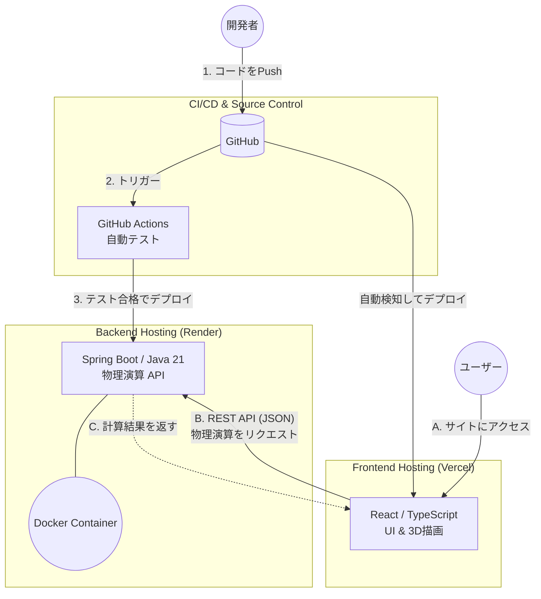

# ダーツ物理シミュレーター (フロントエンド)

*他の言語で読む: [English](README.md), [日本語](README.ja.md)*

インタラクティブな3Dダーツ物理シミュレーションと、セッティング最適化のためのWebアプリケーションです。本プロジェクトは、リッチなフロントエンドと高負荷な計算を行うバックエンドを分離した、モダンで疎結合なクラウドネイティブアーキテクチャを採用しています。

🚀 **[Live Demo URL](https://your-app.vercel.app)** *(※ご自身のVercelのURLに変更してください)*

🔗 **バックエンドリポジトリ:** [darts-sim-api](https://github.com/your-username/darts-sim-api)

---

## 🎯 主な機能

- **3D物理演算ビジュアライゼーション:** バレル/シャフトの重量配分や空気抵抗を考慮した、ダーツの軌道をリアルタイムで描画します。
- **セッティングシミュレーター:** バレル、シャフト、フライトの様々な組み合わせをインタラクティブにテスト可能です。
- **クラウドネイティブパイプライン:** 継続的デプロイ（CI/CD）を完全自動化し、高い信頼性を確保しています。

## 🛠 技術スタック

- **フレームワーク:** React 18 (TypeScript)
- **ビルドツール:** Vite
- **スタイリング/UI:** Modern CSS / コンポーネント駆動アーキテクチャ
- **ホスティング/デプロイ:** Vercel

---

## 🏗 システムアーキテクチャ

UIの描画処理と、重い物理演算を分離するための疎結合アーキテクチャを採用しています。



---

## 🚀 ローカル環境の構築手順

### 前提条件

ローカルマシンに **Node.js (v18以上)** がインストールされていることを確認してください。

### インストールと起動

1. リポジトリをクローンします:
```bash
   git clone [https://github.com/your-username/darts-sim-web.git](https://github.com/your-username/darts-sim-web.git)
   cd darts-sim-web
   ```

2. 依存パッケージをインストールします:
```bash
   npm install
   ```

3. ローカル開発サーバーを起動します:
```bash
   npm run dev
