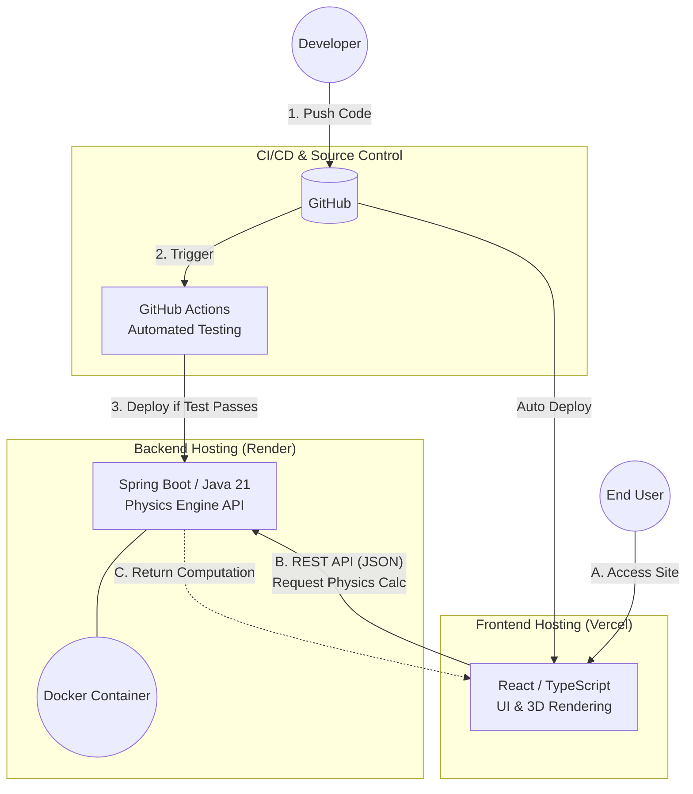

# Darts Physics Simulator (Frontend)

*Read this in other languages: [English](README.md), [日本語](README.ja.md)*

An interactive 3D darts physics simulation and setting optimization web application. This project is built with a modern, decoupled cloud-native architecture, separating the high-fidelity frontend from the heavy-computation backend.

🚀 **[Live Demo URL](https://your-app.vercel.app)** *(Replace with your actual Vercel URL)*

🔗 **Backend Repository:** [darts-sim-api](https://github.com/your-username/darts-sim-api)

---

## 🎯 Key Features

- **3D Physics Visualization:** Real-time rendering of dart trajectories, factoring in barrel/shaft weight distribution and aerodynamics.
- **Setting Simulator:** Interactive configuration to test different combinations of barrels, shafts, and flights.
- **Cloud Native Pipeline:** Fully automated CI/CD pipeline ensuring reliable and continuous deployment.

## 🛠 Tech Stack

- **Framework:** React 18 (TypeScript)
- **Build Tool:** Vite
- **Styling/UI:** Modern CSS / Component-driven architecture
- **Hosting/Deployment:** Vercel

---

## 🏗 System Architecture

This application adopts a decoupled architecture to isolate user interface concerns from heavy physics computations.



---

## 🚀 Getting Started

### Prerequisites

Ensure you have **Node.js (v18 or higher)** installed on your local machine.

### Installation & Local Development

1. Clone the repository:
   ```bash
   git clone [https://github.com/your-username/darts-sim-web.git](https://github.com/your-username/darts-sim-web.git)
   cd darts-sim-web
   ```

2. Install dependencies:
   ```bash
   npm install
   ```

3. Start the local development server:
   ```bash
   npm run dev
   ```

4. Open `http://localhost:5173` in your browser.

*Note: To fetch live data locally, ensure the backend API server (`darts-sim-api`) is running on `http://localhost:8080`.*

---

## 📈 CI/CD & Deployment

- **Production Deployment:** Automatically deployed to **Vercel** on every push to the `main` branch.
- **Environment Variables:** API endpoints are managed dynamically via environment variables for seamless environment switching between local and production.
